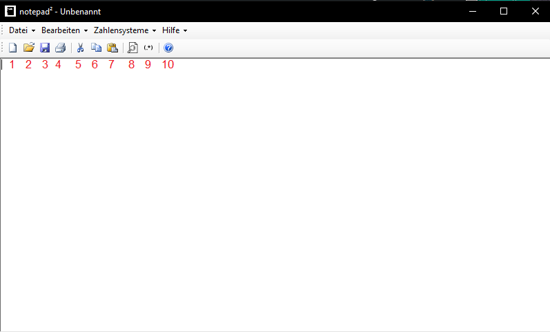

# notepad²
notepad² is an open-source text editor with focus on numeral systems and other handy reverse engineering tools

# Manual

1. You can create an empty text file using this button.
2. You can open files using this button.
3. You can save your file using this button.
4. You can print your file using this button.
5. You can cut text to clipboard using this button.
6. You can copy text to clipboard using this button.
7. You can paste text to the textbox using this button.
8. You can search for a string using this button.
9. You can search with a .NET regex using this button.
10. You can get basic information about notepad² using this button.

You can convert your text to either hex, oct or bin using the buttons under "Zahlensysteme".

To undo the conversion, simply use "In Dec anzeigen" under "Zahlensysteme > YourConversionMethod > In Dec anzeigen"
